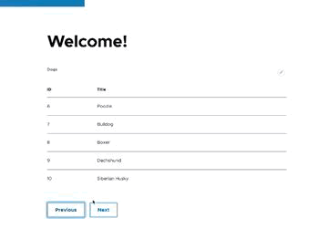

# HDPortal Exercise

This is a basic Drupal installation with ddev containing a module that provides a `hd_entry` content entity and a little react block with pager.

## Setup

Checkout this repository to a folder.

```
ddev start
ddev composer install
ddev drush site:install --account-name=admin --account-pass=admin -y
ddev drush en -y exercise
ddev drush migrate:import --all
```

This will create a fresh drupal installation, install the module and entity and import a couple of dog breeds from a csv file.

Afterwards you can add the `Dog Breeds React Block` to any region through `admin/structure/block`

### React

The react app is in `web/modules/exercise/js/react`. Right now it's obviously very basic, but you can update it by updating `src/index.js`. Then after running `npm install` run `npm run build`.

For the purpose of this exercise the dist `app.bundle.js` has been included in the repository.


